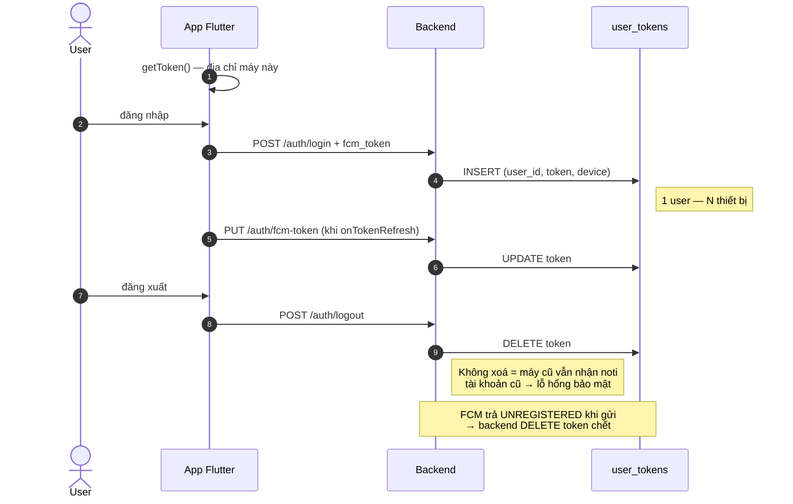
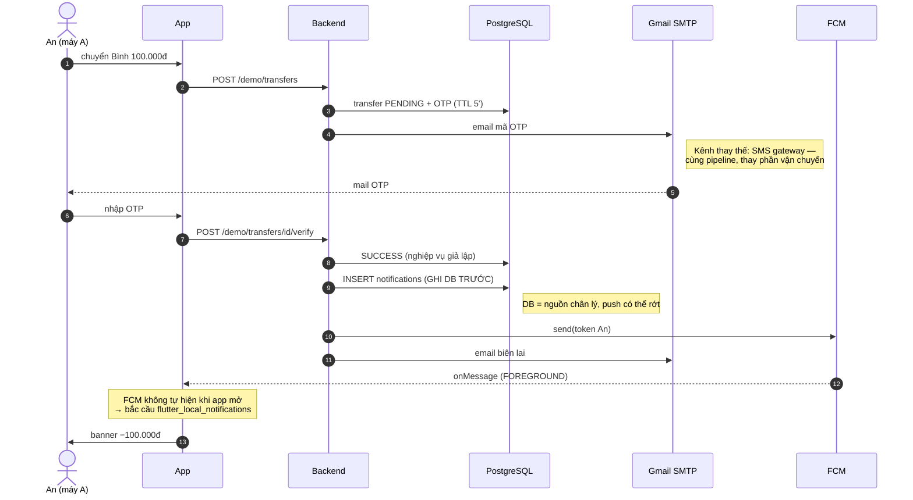
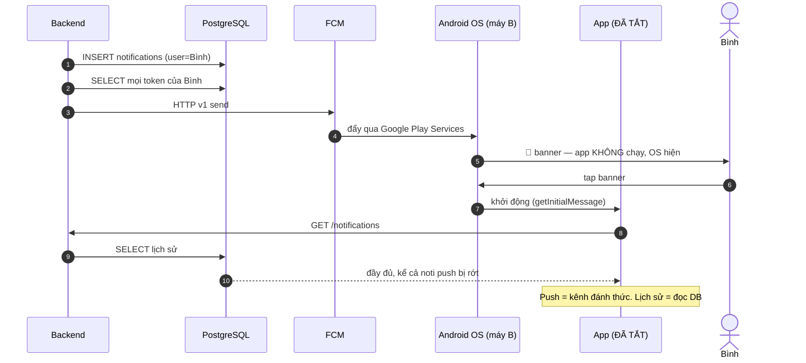
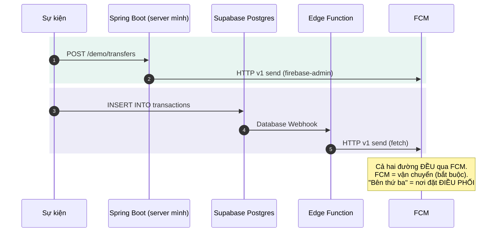

# Notification Service — từ sự kiện tới banner trên điện thoại

> Demo "thông báo thật" kiểu MoMo/banking: sinh ra từ **sự kiện ở backend**, đến tay user
> **kể cả khi app đã tắt**. Toàn bộ pipeline công khai — sequence diagram + source code,
> không có hộp đen. Bài dạy 18–20 phút.

```
Sự kiện (giao dịch) ──► [ NOTIFICATION SERVICE ] ──┬──► Push (FCM)   → banner
                          ghi DB trước, push sau    ├──► Email (SMTP) → OTP, biên lai
                                                    └──► (SMS — cùng pipeline, thay vận chuyển)
```

## Cấu trúc repo

```
backend/    Spring Boot — đường TỰ BUILD (điều phối ở server của mình)
app/        Flutter — phía nhận: token, 3 trạng thái app, lịch sử DB-first
supabase/   Edge Function — đường SERVERLESS (điều phối dời lên Supabase)
diagrams/   4 sequence diagram PlantUML (.puml) — render bằng VS Code/planttext
```

File quan trọng nhất để đọc: **`backend/.../service/NotificationService.java`** —
tầng điều phối, quy trình 3 bước: ghi DB → lấy mọi token → fan-out.

## Các sequence diagram

> Bản PlantUML chi tiết trong `diagrams/`. Dưới đây là bản Mermaid để GitHub render trực tiếp.

### SD-1 · Vòng đời FCM token



### SD-2 · Chuyển tiền + OTP email + foreground bridge (máy A)



### SD-3 · Nhận tiền khi app ĐÃ TẮT (máy B — hero moment)



### SD-4 · Tự build vs Serverless



## Setup từng bước (full, không che)

### 0. Yêu cầu
JDK 17+, Maven, PostgreSQL, Flutter SDK, 2 máy Android thật (có Google Play Services),
1 Gmail có App Password, 1 tài khoản Supabase (cho đường serverless).

### 1. Firebase — CHỈ để lấy FCM
1. https://console.firebase.google.com → Add project (tên tuỳ ý, tắt Analytics cho nhanh).
2. Project settings → **Service accounts** → Generate new private key → lưu thành
   `backend/service-account.json` (⚠️ KHÔNG commit — đã có trong .gitignore).
3. Add app → Android → package `com.demo.notify_demo_app` → tải `google-services.json`
   đặt vào `app/android/app/`.
4. Trong thư mục `app/`: `dart pub global activate flutterfire_cli && flutterfire configure`.

### 2. Backend
```bash
cd backend
cp .env.example .env        # điền MAIL_USER, MAIL_PASSWORD, DB_*
createdb notify_demo        # hoặc tạo DB trong pgAdmin
export $(grep -v '^#' .env | xargs)   # PowerShell: đặt biến môi trường tương ứng
mvn spring-boot:run
```
Bảng tự tạo qua JPA (`ddl-auto: update`): `users`, `user_tokens`, `notifications`, `transfers`.

### 3. App Flutter
1. Sửa `lib/services/api_service.dart` → `baseUrl` = IP LAN của laptop chạy backend
   (2 điện thoại cùng Wi-Fi với laptop), vd `http://192.168.1.10:8080`.
2. Build bản release (bản debug xử lý background message khác đi):
```bash
cd app && flutter pub get && flutter build apk --release
```
3. Cài `build/app/outputs/flutter-apk/app-release.apk` vào CẢ 2 máy.
4. Trên Xiaomi/Oppo/Vivo: Settings → Battery → tắt tối ưu pin cho app
   (+ bật Autostart trên Xiaomi) — nếu không push lúc app tắt sẽ chậm/mất.

### 4. Đường serverless (Supabase)
```bash
supabase functions deploy notify-on-transaction --no-verify-jwt
supabase secrets set FCM_SERVICE_ACCOUNT="$(cat backend/service-account.json)"
```
Tạo bảng + webhook theo hướng dẫn trong `supabase/functions/notify-on-transaction/index.ts`.

## Kịch bản demo 18–20 phút

| Phút | Diễn gì | Chiếu gì |
|---|---|---|
| 0–2 | Toast "Đã lưu" vs banner "nhận 100k lúc đang ngủ" — cái nào là thông báo thật? | Slide |
| 2–5 | Pipeline + 4 kênh + 3 nguồn kích hoạt (server / lịch cục bộ / hành động user) | Slide pipeline |
| 5–7 | Máy A + B cùng đăng nhập 2 tài khoản → chỉ vào log `INSERT user_tokens` | SD-1 |
| 7–11 | Máy A chuyển tiền → **OTP về Gmail** (chiếu hộp thư) → verify → máy A nổ banner (foreground bridge) + email biên lai | SD-2 |
| 11–13 | **Hero**: máy B ĐÃ TẮT app từ trước → banner "Biến động số dư +100.000đ" vẫn nổ → tap → app mở vào lịch sử (đọc từ DB) | SD-3 |
| 13–14 | Nhịp **background**: máy A bấm Home → gọi `/demo/transfers` lần nữa → hệ thống tự hiện banner. Đủ bộ ba trạng thái | Bảng 3 trạng thái |
| 14–15 | `POST /demo/promo` → **cả 2 máy cùng nổ** — token (1 máy) vs topic (1-nhiều) | — |
| 15–17 | Đường serverless: SQL editor `INSERT INTO transactions...` → máy B nổ banner, không server nào của mình chạy | SD-4 |
| 17–19 | So sánh tự build vs bên thứ ba; walkthrough `NotificationService.java` (3 bước) | Code + SD-4 |
| 19–20 | Tổng kết: kênh nào dùng khi nào + Q&A | Slide |

## Câu hỏi thường gặp (chuẩn bị Q&A)

- **Tắt app sao vẫn nhận?** FCM/Google Play Services chạy ở tầng hệ điều hành, không phụ thuộc app sống.
- **Tự build mà vẫn dùng Firebase?** Push tới Android *bắt buộc* qua FCM — đó là vận chuyển. "Tự build" = tự viết phần điều phối.
- **Foreground sao không tự hiện?** FCM cố ý giao quyền cho app khi đang mở → app tự quyết (bắc cầu local).
- **Background handler sao phải top-level + @pragma?** Chạy ở isolate riêng khi app không sống; cần entry-point để không bị tree-shake.
- **Đăng xuất rồi vẫn nhận noti?** Là lỗi nếu quên DELETE token lúc logout — xem SD-1.
- **Push có đảm bảo tới không?** Không (token chết, offline, tắt quyền) → ghi DB trước, push chỉ là kênh đánh thức; giao dịch quan trọng thêm kênh dự phòng (SMS).
- **OTP sao gửi email mà không SMS?** Cùng pipeline, khác vận chuyển; ngân hàng thật thường dùng SMS (qua gateway có phí + brandname); email free và đủ minh hoạ cơ chế.
- **Notification message vs data-only?** Loại đầu OS tự hiện; loại sau app tự xử lý (silent sync, cập nhật badge).
- **Ngoài phạm vi (biết tên là đủ):** idempotency/dedup, batching/digest, user preference per-type, deep link, iOS/APNs, Web Push, SaaS đa kênh (OneSignal/Novu).

## Ghi chú phạm vi (nói rõ với người nghe)

- **Nghiệp vụ chuyển tiền là GIẢ LẬP** (không ledger/số dư thật) — nó chỉ là cái cớ phát sự kiện. Trọng tâm bài là Notification Service.
- Auth giả lập (không mật khẩu/JWT) — trọng tâm là vòng đời token.
- OTP lưu plaintext cho demo — sản phẩm thật phải hash + rate-limit.
- Demo trên Android; iOS cần APNs key (tài khoản Apple Developer trả phí) — cùng pipeline.
